# Install `MySQL MHA` with `Ansible`

## 脚本规范：`Ansible`

### 关于大文件

在Git中，超过100MB的文件为大文件，由于文件过大会导致代码Git的速度很慢，因此，在我的Ansible的脚本中，大文件一般只会留一个文件名占位，但是，会在变量文件中具体说明获取某个大文件的方法。

一般情况下，大文件都位于不同的角色（role）的文件路径`files`中。

例如：

MySQL角色中有一个大文件：


可以看到，这个文件有517MB，属于大文件

因此，在同步GIT的时候，替换成了空文件，但是，保留了文件名：


关于该文件在哪里可以下载到，在角色`mysql`的变量文件中有所说明：

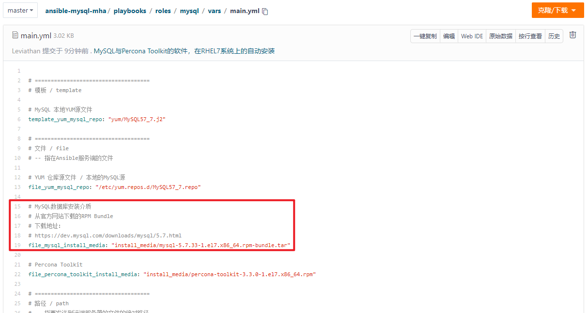

### 当前脚本包含的大文件

有两个：

1. `linux/files/yum`

   从百度云下载：

   \# 链接：https://pan.baidu.com/s/1eYmnPbePk0TC1ed8RyK1Jw 

   \# 提取码：godz 

2. `mysql/files/install_media`

   MySQL的安装介质，从MySQL官方网站获取


### 变量文件

#### 变量命名

1. 文件与路径：

文件位于Ansible服务端：以`file_`开头，命名的是：文件在Ansible服务端的角色内的相对路径

文件位于目标服务器端：以`path_`开头，命名的是：文件传到目标服务器上后的绝对路径

目录：以`directory_`开头，命名的是：目标服务器上的文件夹路径

2. 可以用`with_items`循环的变量：以`list_`开头

## 配置方法

关于本Ansible脚本的默认行为：

1. 数据目录默认设置为：/data
   1. 在运行本脚本之前，最好先在三台服务器上将`/data`目录以单独的数据盘挂载起来

在本Ansible的脚本中，包含四个角色：

1. linux
2. keepalived
3. mysql
4. mysql_mha

如图所示：

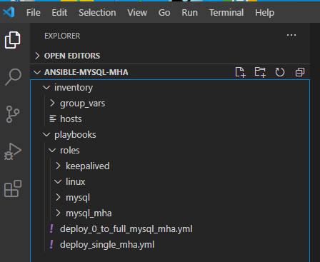

要正确的使用该项目，需要对每个角色做出正确的配置；

下面会一一说明。

### Ansible剧本文件：Deploy_0_to_full_mysql_mha.yml

剧本文件需要位于Ansible的`roles`目录的同级文件夹下，如下：

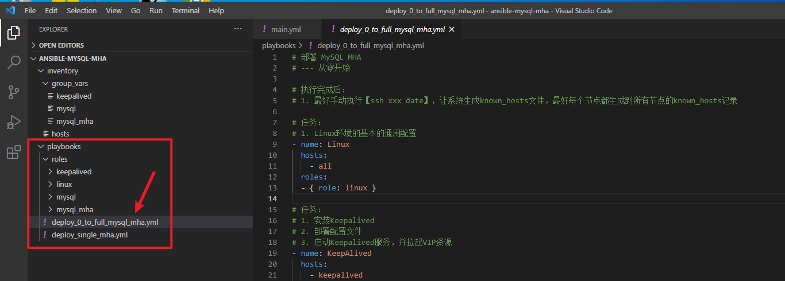

这个剧本文件脚本已经准备好了，该文件不需要修改。

在正式安装的时候，只需要执行即可（执行的方法在后续的`使用方法`部分有罗列）

剧本文件内容：

文件名：`deploy_0_to_full_mysql_mha.yml`

文件内容：

```
# 部署 MySQL MHA
# --- 从零开始

# 执行完成后：
# 1. 最好手动执行【ssh xxx date】，让系统生成known_hosts文件，最好每个节点都生成到所有节点的known_hosts记录

# 任务：
# 1. Linux环境的基本的通用配置
- name: Linux
  hosts: 
    - all
  roles:
  - { role: linux }

# 任务：
# 1. 安装Keepalived
# 2. 部署配置文件
# 3. 启动Keepalived服务，并拉起VIP资源
- name: KeepAlived
  hosts: 
    - keepalived
  roles:
  - { role: keepalived }

# 任务：
# 1. 安装MySQL
# 2. 配置MySQL的主从架构
# 3. 在主节点上运行SQL脚本
- name: MySQL
  hosts: 
    - mysql
  roles:
  - { role: mysql }

# 任务：
# 1. 安装MySQL MHA
# 2. 部署MHA配置文件
# 3. 部署MHA二次开发脚本
# 4. 启动MySQL MHA
- name: MySQL MHA
  hosts: 
    - mysql_mha
  roles:
  - { role: mysql_mha }
```


### Ansible目标服务器资源文件：Inventory

目标服务器的Inventory文件位于：`inventory/hosts`，如下：

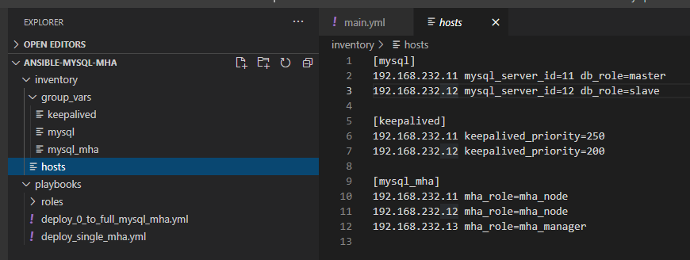

可以看到有三组：

1. 组`mysql`
   1. db_role，定义服务器的角色
      1. master，主库
      2. slave，从库
2. 组`keepalived`
   1. keepalived_priority，定义KeepAlived的服务器权重
      1. 在当前脚本中，权重只有两个值选择，250 / 200
         1. 250，优先
         2. 200，备选
3. 组`mysql_mha`
   1. mha_role，定义服务器的角色
      1. mha_node，MHA的被管节点，MySQL的服务器都是被管节点
      2. mha_manager，MHA的管理节点

#### 组变量文件

组的变量文件存放在：`inventory/group_vars`目录中，并且，以服务器组名称命名文件，如下：

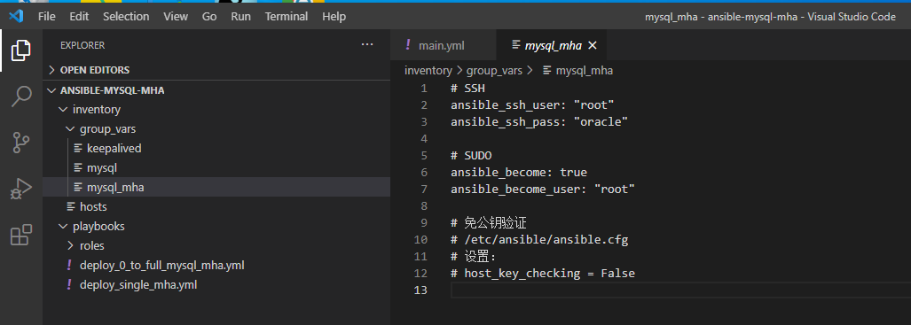

说明：

SSH部分：

1. 如果知道Ansible脚本执行时候的远程SSH的用户口令，需要根据实际起舞in概况填写
2. 如果执行Ansible的用户已经免密，需要把SSH部分的两行代码注释

SUDO部分：

1. 执行Ansible任务的时候，是否sudo到系统用户权限执行

免公钥验证部分：

1. 在Ansible的配置文件中关闭了公钥验证后，就不会出现SSH到一个全新的服务器的时候，提示yes，获取一下公钥记录到`known_hosts`文件的错误。


### 角色：Linux

角色`linux`的目标是完成基本的Linux操作系统环境的准备工作，包括安装与配置；

它的结构如下：

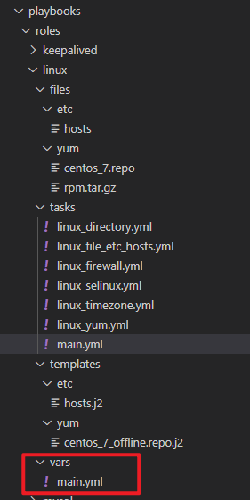

如图所示，配置该角色只需要关注变量文件`vars/main.yml`；

该文件需要修改的部分是：

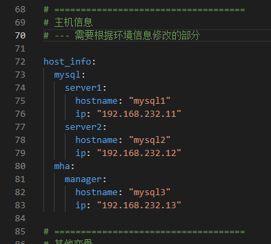

根据不同的环境，定义：

1. MySQL的两台服务器的主机名与IP：
2. MHA的管理节点的主机名与IP；

需要注意的是：

1. 主机名与IP，应该是在运行本Ansible脚本之前就准备好的
2. 主机名与IP，需要与目标服务器一致
3. 该变量文件的其他变量不要改变，其他变量会影响到脚本的运行

### 角色：KeepAlived

角色`keepalived`的目标是完成KeepAlived的安装与配置；

它的结构如下：

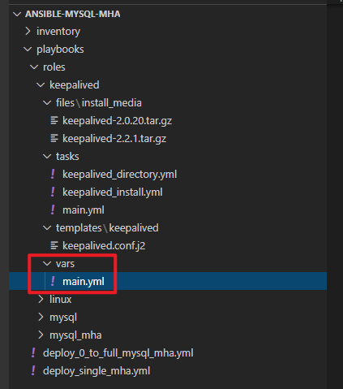

如图所示，该角色的配置只需要关注变量文件：`vars/main.yml`

其中需要配置的部分：

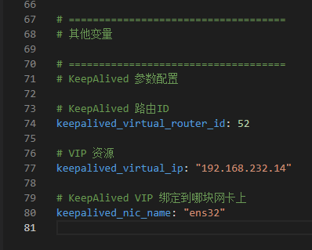

配置项说明：

1. 如果在同一个网段里已有了一套KeepAlived，那么`keepalived_virtual_router_id`，必须不同
2. `keepalived_virtual_ip`，表示你的KeepAlived要绑定的VIP资源
3. `keepalived_nic_name`，表示你希望在哪块网卡上绑定VIP资源
   1. 注意，不同的Linux发行版可能网卡名称会不一样，例如有的Linux中的主网卡名称是`eth0`，而另一些Linux中的主网卡的名称则变成了`ens32`，需要提前在系统中确认好了以后，做出正确的配置
   2. 如果该参数配置不正确，则KeepAlived服务启动失败，VIP资源绑定失败

### 角色：MySQL

角色`mysql`的目标是：

1. 完成MySQL数据库的软件安装
2. 初始化MySQL的管理账号【root@localhost】的口令
3. 配置MySQL的主从同步
4. 执行MySQL初始化SQL
   1. 建库
   2. 建用户
   3. 等等

该角色的代码结构如下：

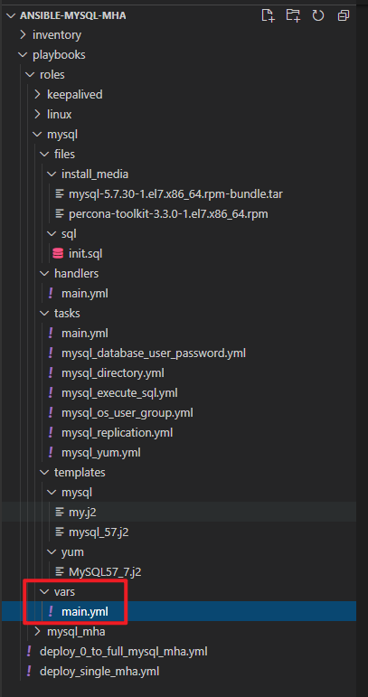

如图所示，该角色的配置只需要关注变量文件：`vars/main.yml`

变量文件中需要关注的部分如下：

#### 安装介质的选择

将安装介质上传到角色的目录`files/install_media/`中，如下：

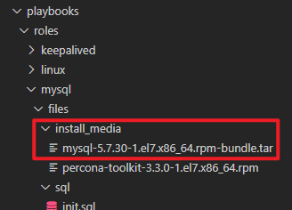

然后修改变量文件中的变量`file_mysql_install_media`，如下：

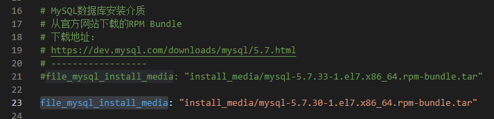

#### MySQL 参数文件

MySQL的参数文件，以模板的形式，存放在：`templates/mysql/my.j2`，如下：

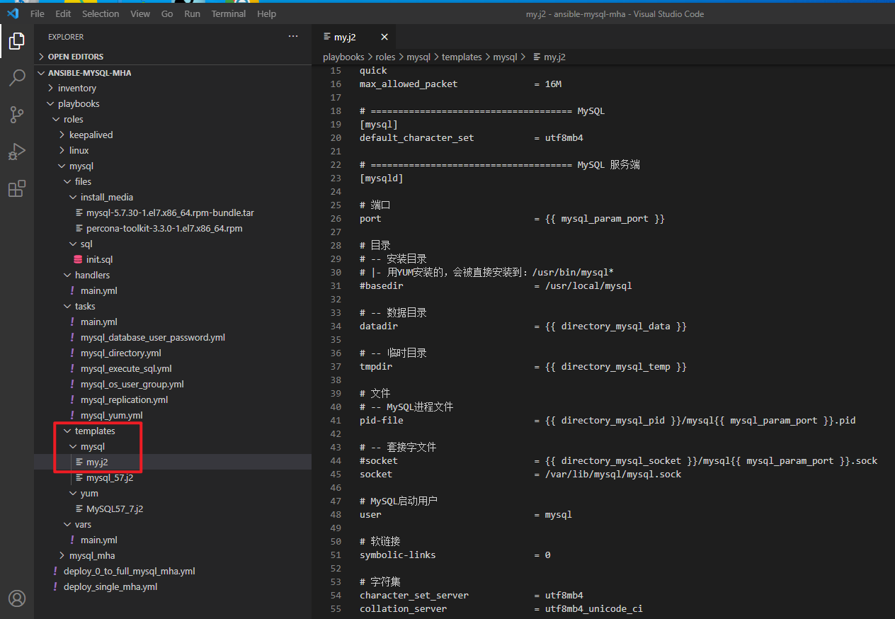

脚本通过变量文件中的参数：`template_mysql_my_cfg`执行引用：

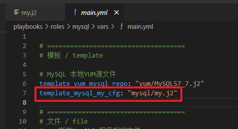

可以看到，目前引用的是：`my.j2`

MySQL的参数有一部分可以在变量文件中配置，如果变量文件中没有包含的，可以直接修改模板文件中的值。

#### 变量文件中需要修改的部分

在角色`mysql`的变量文件中，需要修改的部分是：

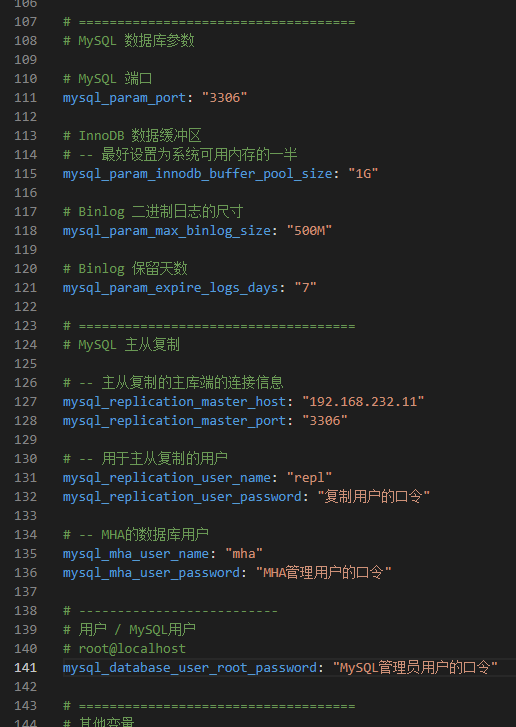

可以从注释中看到各个变量的含义，需要根据实际的环境的情况对应修改。

注意：

1. 除了上述截图中的参数之外，其他的参数可以不需要修改，不正确的修改可能会影响脚本的正确执行


### 角色：MySQL MHA

角色`mysql_mha`的目标是：

1. 完成MHA的安装
2. 完成MHA的基本配置
3. 完成MHA扩展脚本的部署
4. 启动MHA的管理节点管理进程【masterha_manager】

该角色的代码结构如下：

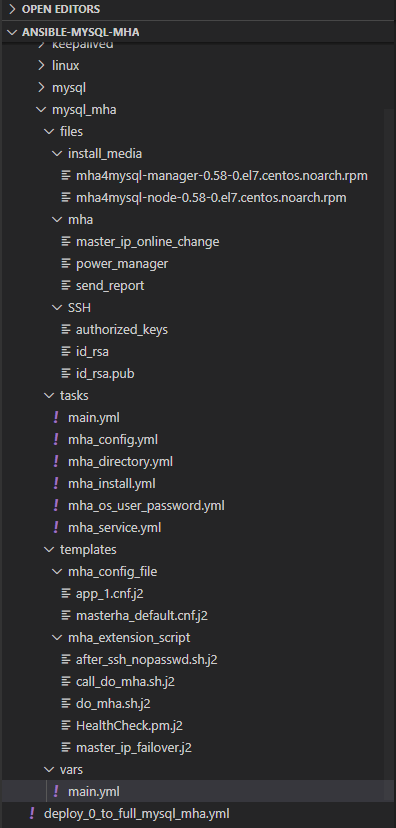

如图所示，该角色的配置只需要关注变量文件：`vars/main.yml`

该变量文件中，只需要关注：

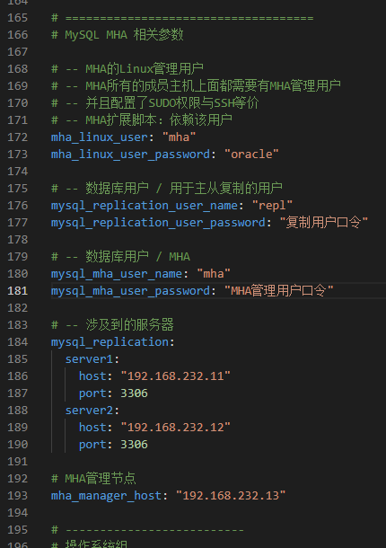

这一部分的配置，需要和前面MySQL的配置一致。


## 使用方法：上传代码包并解压

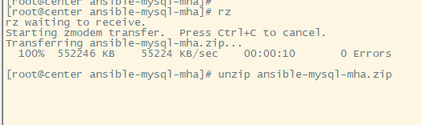

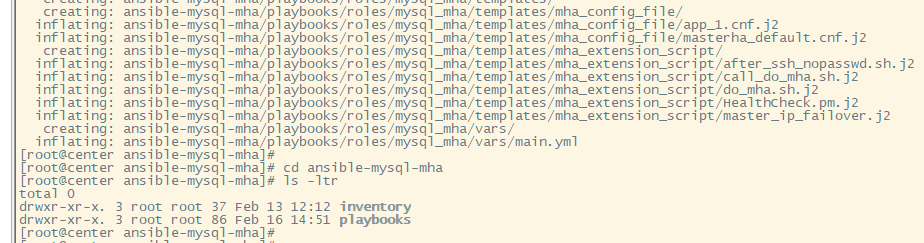


## 使用方法：`Ansible Playbook`：执行

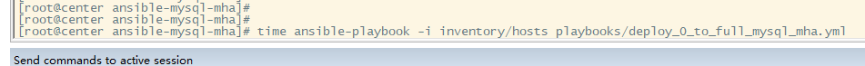

截图命令中的【time】不是必须的，这里添加`time`是为了后续统计脚本执行时间。

脚本执行完成后如下：

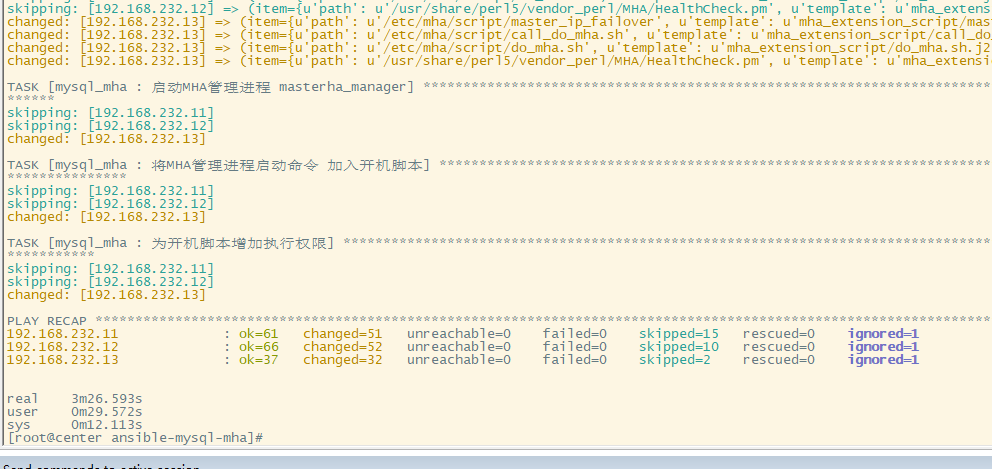

可以看到，执行时间只用了：【3m26.593s】

完整的执行过程如下：

```
【20210217_15:23:37.061】[root@center ansible-mysql-mha]# time ansible-playbook -i inventory/hosts playbooks/deploy_0_to_full_mysql_mha.yml 
【20210217_15:23:37.799】
【20210217_15:23:37.800】PLAY [Linux] **************************************************************************************************************************************************************************************************************
【20210217_15:23:37.816】
【20210217_15:23:37.817】TASK [Gathering Facts] ****************************************************************************************************************************************************************************************************
【20210217_15:23:45.983】ok: [192.168.232.12]
【20210217_15:23:46.143】ok: [192.168.232.13]
【20210217_15:23:46.254】ok: [192.168.232.11]
【20210217_15:23:46.274】
【20210217_15:23:46.276】TASK [linux : 创建目录] *******************************************************************************************************************************************************************************************************
【20210217_15:23:46.688】changed: [192.168.232.11] => (item=/software_upload)
【20210217_15:23:46.700】changed: [192.168.232.13] => (item=/software_upload)
【20210217_15:23:46.719】changed: [192.168.232.12] => (item=/software_upload)
【20210217_15:23:46.904】changed: [192.168.232.13] => (item=/backup)
【20210217_15:23:46.908】changed: [192.168.232.11] => (item=/backup)
【20210217_15:23:46.955】changed: [192.168.232.12] => (item=/backup)
【20210217_15:23:47.104】changed: [192.168.232.11] => (item=/data)
【20210217_15:23:47.136】changed: [192.168.232.13] => (item=/data)
【20210217_15:23:47.171】changed: [192.168.232.12] => (item=/data)
【20210217_15:23:47.349】changed: [192.168.232.13] => (item=/script)
【20210217_15:23:47.349】changed: [192.168.232.11] => (item=/script)
【20210217_15:23:47.377】changed: [192.168.232.12] => (item=/script)
【20210217_15:23:47.545】changed: [192.168.232.13] => (item=/iso)
【20210217_15:23:47.565】changed: [192.168.232.11] => (item=/iso)
【20210217_15:23:47.580】changed: [192.168.232.12] => (item=/iso)
【20210217_15:23:47.598】
【20210217_15:23:47.598】TASK [linux : 配置YUM参数文件：启用RPM缓存] ******************************************************************************************************************************************************************************************
【20210217_15:23:47.954】changed: [192.168.232.12]
【20210217_15:23:47.975】changed: [192.168.232.13]
【20210217_15:23:47.985】changed: [192.168.232.11]
【20210217_15:23:47.998】
【20210217_15:23:47.998】TASK [linux : 为Linux添加YUM源] ***********************************************************************************************************************************************************************************************
【20210217_15:23:48.989】changed: [192.168.232.13]
【20210217_15:23:48.996】changed: [192.168.232.12]
【20210217_15:23:49.010】changed: [192.168.232.11]
【20210217_15:23:49.017】
【20210217_15:23:49.017】TASK [linux : 刷新YUM缓存] ****************************************************************************************************************************************************************************************************
【20210217_15:24:03.954】[WARNING]: Consider using the yum module rather than running 'yum'.  If you need to use command because yum is insufficient you can add 'warn: false' to this command task or set 'command_warnings=False' in ansible.cfg
【20210217_15:24:03.954】to get rid of this message.
【20210217_15:24:03.954】changed: [192.168.232.12]
【20210217_15:24:08.263】changed: [192.168.232.13]
【20210217_15:24:11.333】changed: [192.168.232.11]
【20210217_15:24:11.347】
【20210217_15:24:11.348】TASK [linux : YUM / Install RPM] ******************************************************************************************************************************************************************************************
【20210217_15:24:59.800】changed: [192.168.232.12]
【20210217_15:25:15.271】changed: [192.168.232.13]
【20210217_15:25:18.923】changed: [192.168.232.11]
【20210217_15:25:18.929】
【20210217_15:25:18.929】TASK [linux : 修改时区为：上海] ***************************************************************************************************************************************************************************************************
【20210217_15:25:19.183】changed: [192.168.232.12]
【20210217_15:25:19.184】changed: [192.168.232.11]
【20210217_15:25:19.212】changed: [192.168.232.13]
【20210217_15:25:19.222】
【20210217_15:25:19.223】TASK [linux : 禁用SELinux] **************************************************************************************************************************************************************************************************
【20210217_15:25:19.467】ok: [192.168.232.11]
【20210217_15:25:19.469】ok: [192.168.232.12]
【20210217_15:25:19.478】ok: [192.168.232.13]
【20210217_15:25:19.487】
【20210217_15:25:19.488】TASK [linux : 切换SELinux为：宽容模式] ********************************************************************************************************************************************************************************************
【20210217_15:25:19.733】fatal: [192.168.232.11]: FAILED! => {"changed": true, "cmd": "setenforce 0", "delta": "0:00:00.002743", "end": "2021-02-17 15:25:19.692968", "msg": "non-zero return code", "rc": 1, "start": "2021-02-17 15:25:19.690225", "stderr": "setenforce: SELinux is disabled", "stderr_lines": ["setenforce: SELinux is disabled"], "stdout": "", "stdout_lines": []}
【20210217_15:25:19.736】...ignoring
【20210217_15:25:19.737】fatal: [192.168.232.12]: FAILED! => {"changed": true, "cmd": "setenforce 0", "delta": "0:00:00.002890", "end": "2021-02-17 15:25:19.417339", "msg": "non-zero return code", "rc": 1, "start": "2021-02-17 15:25:19.414449", "stderr": "setenforce: SELinux is disabled", "stderr_lines": ["setenforce: SELinux is disabled"], "stdout": "", "stdout_lines": []}
【20210217_15:25:19.738】...ignoring
【20210217_15:25:19.750】fatal: [192.168.232.13]: FAILED! => {"changed": true, "cmd": "setenforce 0", "delta": "0:00:00.003159", "end": "2021-02-17 15:25:19.423534", "msg": "non-zero return code", "rc": 1, "start": "2021-02-17 15:25:19.420375", "stderr": "setenforce: SELinux is disabled", "stderr_lines": ["setenforce: SELinux is disabled"], "stdout": "", "stdout_lines": []}
【20210217_15:25:19.753】...ignoring
【20210217_15:25:19.757】
【20210217_15:25:19.758】TASK [linux : SELinux状态] **************************************************************************************************************************************************************************************************
【20210217_15:25:19.969】changed: [192.168.232.11]
【20210217_15:25:20.007】changed: [192.168.232.12]
【20210217_15:25:20.021】changed: [192.168.232.13]
【20210217_15:25:20.028】
【20210217_15:25:20.029】TASK [linux : 输出SELinux的状态] ***********************************************************************************************************************************************************************************************
【20210217_15:25:20.076】ok: [192.168.232.11] => {
【20210217_15:25:20.076】    "msg": "SELinux status:                 disabled"
【20210217_15:25:20.077】}
【20210217_15:25:20.079】ok: [192.168.232.12] => {
【20210217_15:25:20.079】    "msg": "SELinux status:                 disabled"
【20210217_15:25:20.080】}
【20210217_15:25:20.097】ok: [192.168.232.13] => {
【20210217_15:25:20.097】    "msg": "SELinux status:                 disabled"
【20210217_15:25:20.097】}
【20210217_15:25:20.104】
【20210217_15:25:20.104】TASK [linux : 关停Linux防火墙，并禁止开机启动] *****************************************************************************************************************************************************************************************
【20210217_15:25:21.528】changed: [192.168.232.12]
【20210217_15:25:21.531】changed: [192.168.232.11]
【20210217_15:25:21.546】changed: [192.168.232.13]
【20210217_15:25:21.558】
【20210217_15:25:21.559】TASK [linux : 查看Ansible Facts] ********************************************************************************************************************************************************************************************
【20210217_15:25:21.593】ok: [192.168.232.12] => {
【20210217_15:25:21.594】    "msg": "主机名【mysql2】IP地址【192.168.232.12】"
【20210217_15:25:21.595】}
【20210217_15:25:21.597】ok: [192.168.232.11] => {
【20210217_15:25:21.597】    "msg": "主机名【mysql1】IP地址【192.168.232.11】"
【20210217_15:25:21.598】}
【20210217_15:25:21.613】ok: [192.168.232.13] => {
【20210217_15:25:21.613】    "msg": "主机名【mysql3】IP地址【192.168.232.13】"
【20210217_15:25:21.613】}
【20210217_15:25:21.643】
【20210217_15:25:21.643】TASK [linux : 文件：/etc/hosts] **********************************************************************************************************************************************************************************************
【20210217_15:25:22.085】changed: [192.168.232.13]
【20210217_15:25:22.095】changed: [192.168.232.12]
【20210217_15:25:22.117】changed: [192.168.232.11]
【20210217_15:25:22.124】
【20210217_15:25:22.125】PLAY [KeepAlived] *********************************************************************************************************************************************************************************************************
【20210217_15:25:22.141】
【20210217_15:25:22.142】TASK [Gathering Facts] ****************************************************************************************************************************************************************************************************
【20210217_15:25:22.625】ok: [192.168.232.11]
【20210217_15:25:22.649】ok: [192.168.232.12]
【20210217_15:25:22.660】
【20210217_15:25:22.661】TASK [keepalived : 创建目录] **************************************************************************************************************************************************************************************************
【20210217_15:25:22.899】ok: [192.168.232.12] => (item=/software_upload)
【20210217_15:25:22.899】ok: [192.168.232.11] => (item=/software_upload)
【20210217_15:25:23.102】changed: [192.168.232.11] => (item=/usr/local/keepalived)
【20210217_15:25:23.103】changed: [192.168.232.12] => (item=/usr/local/keepalived)
【20210217_15:25:23.299】changed: [192.168.232.11] => (item=/etc/keepalived)
【20210217_15:25:23.315】changed: [192.168.232.12] => (item=/etc/keepalived)
【20210217_15:25:23.336】
【20210217_15:25:23.336】TASK [keepalived : 解压安装介质] ************************************************************************************************************************************************************************************************
【20210217_15:25:24.061】changed: [192.168.232.11]
【20210217_15:25:24.092】changed: [192.168.232.12]
【20210217_15:25:24.107】
【20210217_15:25:24.108】TASK [keepalived : 源码包安装：configure] ***************************************************************************************************************************************************************************************
【20210217_15:25:30.654】changed: [192.168.232.12]
【20210217_15:25:30.696】changed: [192.168.232.11]
【20210217_15:25:30.702】
【20210217_15:25:30.702】TASK [keepalived : 源码包安装：make] ********************************************************************************************************************************************************************************************
【20210217_15:25:40.457】changed: [192.168.232.11]
【20210217_15:25:40.556】changed: [192.168.232.12]
【20210217_15:25:40.556】
【20210217_15:25:40.557】TASK [keepalived : 源码包安装：make install] ************************************************************************************************************************************************************************************
【20210217_15:25:40.965】changed: [192.168.232.11]
【20210217_15:25:40.987】changed: [192.168.232.12]
【20210217_15:25:40.992】
【20210217_15:25:40.993】TASK [keepalived : KeepAlived 启动脚本变量文件] ***********************************************************************************************************************************************************************************
【20210217_15:25:41.215】changed: [192.168.232.11]
【20210217_15:25:41.236】changed: [192.168.232.12]
【20210217_15:25:41.250】
【20210217_15:25:41.251】TASK [keepalived : KeepAlived 主程序] ****************************************************************************************************************************************************************************************
【20210217_15:25:41.453】[WARNING]: Consider using the file module with state=link rather than running 'ln'.  If you need to use command because file is insufficient you can add 'warn: false' to this command task or set
【20210217_15:25:41.453】'command_warnings=False' in ansible.cfg to get rid of this message.
【20210217_15:25:41.454】changed: [192.168.232.11]
【20210217_15:25:41.468】changed: [192.168.232.12]
【20210217_15:25:41.477】
【20210217_15:25:41.477】TASK [keepalived : KeepAlived 配置文件] ***************************************************************************************************************************************************************************************
【20210217_15:25:41.894】changed: [192.168.232.11]
【20210217_15:25:41.903】changed: [192.168.232.12]
【20210217_15:25:41.912】
【20210217_15:25:41.912】TASK [keepalived : 启动 KeepAlived 服务] **************************************************************************************************************************************************************************************
【20210217_15:25:42.215】changed: [192.168.232.12]
【20210217_15:25:42.224】changed: [192.168.232.11]
【20210217_15:25:42.233】
【20210217_15:25:42.233】TASK [keepalived : 获取KeepAlived启动后的IP资源情况] ********************************************************************************************************************************************************************************
【20210217_15:25:42.441】changed: [192.168.232.12]
【20210217_15:25:42.455】changed: [192.168.232.11]
【20210217_15:25:42.462】
【20210217_15:25:42.463】TASK [keepalived : 启动KeepAlived后的IP资源状态] **********************************************************************************************************************************************************************************
【20210217_15:25:42.483】ok: [192.168.232.11] => {
【20210217_15:25:42.483】    "msg": [
【20210217_15:25:42.483】        "192.168.232.11/24"
【20210217_15:25:42.483】    ]
【20210217_15:25:42.484】}
【20210217_15:25:42.494】ok: [192.168.232.12] => {
【20210217_15:25:42.494】    "msg": [
【20210217_15:25:42.494】        "192.168.232.12/24"
【20210217_15:25:42.494】    ]
【20210217_15:25:42.494】}
【20210217_15:25:42.501】
【20210217_15:25:42.502】PLAY [MySQL] **************************************************************************************************************************************************************************************************************
【20210217_15:25:42.528】
【20210217_15:25:42.529】TASK [Gathering Facts] ****************************************************************************************************************************************************************************************************
【20210217_15:25:43.041】ok: [192.168.232.11]
【20210217_15:25:43.048】ok: [192.168.232.12]
【20210217_15:25:43.064】
【20210217_15:25:43.066】TASK [mysql : 创建Linux系统组] *************************************************************************************************************************************************************************************************
【20210217_15:25:43.540】changed: [192.168.232.12] => (item={u'gid': 2000, u'group_name': u'mysql'})
【20210217_15:25:43.554】changed: [192.168.232.11] => (item={u'gid': 2000, u'group_name': u'mysql'})
【20210217_15:25:43.777】changed: [192.168.232.12] => (item={u'gid': 3000, u'group_name': u'app'})
【20210217_15:25:43.793】changed: [192.168.232.11] => (item={u'gid': 3000, u'group_name': u'app'})
【20210217_15:25:43.800】
【20210217_15:25:43.802】TASK [mysql : 创建Linux系统用户] ************************************************************************************************************************************************************************************************
【20210217_15:25:44.345】changed: [192.168.232.12] => (item={u'username': u'mysql', u'comment': u'MySQL\u6570\u636e\u5e93\u7684Linux\u7cfb\u7edf\u7528\u6237', u'shell': u'/bin/bash', u'group': u'mysql', u'uid': 2000, u'groups': [u'mysql'], u'password': u'oracle', u'dir_home': u'/home/mysql'})
【20210217_15:25:44.356】changed: [192.168.232.11] => (item={u'username': u'mysql', u'comment': u'MySQL\u6570\u636e\u5e93\u7684Linux\u7cfb\u7edf\u7528\u6237', u'shell': u'/bin/bash', u'group': u'mysql', u'uid': 2000, u'groups': [u'mysql'], u'password': u'oracle', u'dir_home': u'/home/mysql'})
【20210217_15:25:44.371】
【20210217_15:25:44.373】TASK [mysql : 创建目录] *******************************************************************************************************************************************************************************************************
【20210217_15:25:44.592】changed: [192.168.232.12] => (item=/data/mysql)
【20210217_15:25:44.622】changed: [192.168.232.11] => (item=/data/mysql)
【20210217_15:25:44.792】changed: [192.168.232.12] => (item=/data/mysql/datadir)
【20210217_15:25:44.882】changed: [192.168.232.11] => (item=/data/mysql/datadir)
【20210217_15:25:45.016】changed: [192.168.232.12] => (item=/data/mysql/tempdir)
【20210217_15:25:45.095】changed: [192.168.232.11] => (item=/data/mysql/tempdir)
【20210217_15:25:45.225】changed: [192.168.232.12] => (item=/data/mysql/binlog)
【20210217_15:25:45.293】changed: [192.168.232.11] => (item=/data/mysql/binlog)
【20210217_15:25:45.446】changed: [192.168.232.12] => (item=/data/mysql/slowlog)
【20210217_15:25:45.500】changed: [192.168.232.11] => (item=/data/mysql/slowlog)
【20210217_15:25:45.662】changed: [192.168.232.12] => (item=/data/mysql/relaylog)
【20210217_15:25:45.698】changed: [192.168.232.11] => (item=/data/mysql/relaylog)
【20210217_15:25:45.882】changed: [192.168.232.12] => (item=/data/mysql/socket)
【20210217_15:25:45.913】changed: [192.168.232.11] => (item=/data/mysql/socket)
【20210217_15:25:46.094】changed: [192.168.232.12] => (item=/data/mysql/pid)
【20210217_15:25:46.136】changed: [192.168.232.11] => (item=/data/mysql/pid)
【20210217_15:25:46.317】changed: [192.168.232.12] => (item=/software_upload/mysql)
【20210217_15:25:46.352】changed: [192.168.232.11] => (item=/software_upload/mysql)
【20210217_15:25:46.373】
【20210217_15:25:46.374】TASK [mysql : 解压安装介质] *****************************************************************************************************************************************************************************************************
【20210217_15:26:02.678】changed: [192.168.232.12]
【20210217_15:26:02.687】changed: [192.168.232.11]
【20210217_15:26:02.697】
【20210217_15:26:02.698】TASK [mysql : Percona Toolkit 拷贝到目标路径] ************************************************************************************************************************************************************************************
【20210217_15:26:03.936】changed: [192.168.232.12]
【20210217_15:26:03.946】changed: [192.168.232.11]
【20210217_15:26:03.949】
【20210217_15:26:03.950】TASK [mysql : 创建MySQL本地YUM源] **********************************************************************************************************************************************************************************************
【20210217_15:26:04.818】changed: [192.168.232.11]
【20210217_15:26:04.839】changed: [192.168.232.12]
【20210217_15:26:04.855】
【20210217_15:26:04.856】TASK [mysql : 将MySQL本地源注册到Linux系统] ****************************************************************************************************************************************************************************************
【20210217_15:26:05.224】changed: [192.168.232.12]
【20210217_15:26:05.262】changed: [192.168.232.11]
【20210217_15:26:05.279】
【20210217_15:26:05.279】TASK [mysql : 刷新YUM缓存] ****************************************************************************************************************************************************************************************************
【20210217_15:26:06.385】changed: [192.168.232.11]
【20210217_15:26:06.423】changed: [192.168.232.12]
【20210217_15:26:06.427】
【20210217_15:26:06.427】TASK [mysql : YUM / Install RPM] ******************************************************************************************************************************************************************************************
【20210217_15:26:28.567】changed: [192.168.232.11]
【20210217_15:26:28.720】changed: [192.168.232.12]
【20210217_15:26:28.727】
【20210217_15:26:28.727】TASK [mysql : MySQL参数文件] **************************************************************************************************************************************************************************************************
【20210217_15:26:29.167】changed: [192.168.232.11]
【20210217_15:26:29.189】changed: [192.168.232.12]
【20210217_15:26:29.201】
【20210217_15:26:29.201】TASK [mysql : 启动MySQL服务] **************************************************************************************************************************************************************************************************
【20210217_15:26:33.750】changed: [192.168.232.11]
【20210217_15:26:33.796】changed: [192.168.232.12]
【20210217_15:26:33.817】
【20210217_15:26:33.817】TASK [mysql : 从MySQL的错误日志中找到临时口令] *****************************************************************************************************************************************************************************************
【20210217_15:26:34.036】changed: [192.168.232.11]
【20210217_15:26:34.065】changed: [192.168.232.12]
【20210217_15:26:34.071】
【20210217_15:26:34.071】TASK [mysql : MySQL数据库第一次启动时生成的临时口令] **************************************************************************************************************************************************************************************
【20210217_15:26:34.089】ok: [192.168.232.11] => {
【20210217_15:26:34.089】    "msg": "X+Q?8h0dwxVi"
【20210217_15:26:34.089】}
【20210217_15:26:34.106】ok: [192.168.232.12] => {
【20210217_15:26:34.106】    "msg": "jsDRLlP/+8lB"
【20210217_15:26:34.107】}
【20210217_15:26:34.115】
【20210217_15:26:34.115】TASK [mysql : 修改MySQL的临时口令] ***********************************************************************************************************************************************************************************************
【20210217_15:26:34.348】changed: [192.168.232.11]
【20210217_15:26:34.349】changed: [192.168.232.12]
【20210217_15:26:34.353】
【20210217_15:26:34.354】TASK [mysql : 创建MySQL数据库用户] ***********************************************************************************************************************************************************************************************
【20210217_15:26:34.819】changed: [192.168.232.12] => (item={u'username': u'mha', u'host': u'%', u'password': u'oracle', u'priv': u'*.*:ALL'})
【20210217_15:26:34.852】changed: [192.168.232.11] => (item={u'username': u'mha', u'host': u'%', u'password': u'oracle', u'priv': u'*.*:ALL'})
【20210217_15:26:35.047】changed: [192.168.232.12] => (item={u'username': u'public1', u'host': u'%', u'password': u'oracle', u'priv': u'*.*:ALL'})
【20210217_15:26:35.092】changed: [192.168.232.11] => (item={u'username': u'public1', u'host': u'%', u'password': u'oracle', u'priv': u'*.*:ALL'})
【20210217_15:26:35.282】changed: [192.168.232.12] => (item={u'username': u'repl', u'host': u'%', u'password': u'Abcd1@34', u'priv': u'*.*:REPLICATION SLAVE,REPLICATION CLIENT'})
【20210217_15:26:35.282】[WARNING]: Module did not set no_log for update_password
【20210217_15:26:35.333】changed: [192.168.232.11] => (item={u'username': u'repl', u'host': u'%', u'password': u'Abcd1@34', u'priv': u'*.*:REPLICATION SLAVE,REPLICATION CLIENT'})
【20210217_15:26:35.366】
【20210217_15:26:35.366】TASK [mysql : 从库：获取主库信息] **************************************************************************************************************************************************************************************************
【20210217_15:26:35.392】skipping: [192.168.232.11]
【20210217_15:26:35.836】ok: [192.168.232.12 -> 192.168.232.11]
【20210217_15:26:35.843】
【20210217_15:26:35.843】TASK [mysql : 主库：Master Status] *******************************************************************************************************************************************************************************************
【20210217_15:26:35.860】skipping: [192.168.232.11]
【20210217_15:26:35.883】ok: [192.168.232.12] => {
【20210217_15:26:35.883】    "msg": "File【mysql-bin.000002】 / Position【1755】"
【20210217_15:26:35.883】}
【20210217_15:26:35.889】
【20210217_15:26:35.890】TASK [mysql : 从库：Change Master] *******************************************************************************************************************************************************************************************
【20210217_15:26:35.902】skipping: [192.168.232.11]
【20210217_15:26:36.118】changed: [192.168.232.12]
【20210217_15:26:36.132】
【20210217_15:26:36.133】TASK [mysql : 从库：Start Slave] *********************************************************************************************************************************************************************************************
【20210217_15:26:36.140】skipping: [192.168.232.11]
【20210217_15:26:36.378】changed: [192.168.232.12]
【20210217_15:26:36.378】
【20210217_15:26:36.379】TASK [mysql : 从库：获取从库信息] **************************************************************************************************************************************************************************************************
【20210217_15:26:36.392】skipping: [192.168.232.11]
【20210217_15:26:36.611】ok: [192.168.232.12]
【20210217_15:26:36.619】
【20210217_15:26:36.620】TASK [mysql : 从库：Slave Status] ********************************************************************************************************************************************************************************************
【20210217_15:26:36.637】skipping: [192.168.232.11]
【20210217_15:26:36.660】ok: [192.168.232.12] => {
【20210217_15:26:36.660】    "msg": "Slave_IO_Running【Yes】 / Slave_SQL_Running【Yes】 / Slave_SQL_Running_State【Slave has read all relay log; waiting for more updates】 / Seconds_Behind_Master【0】"
【20210217_15:26:36.661】}
【20210217_15:26:36.666】
【20210217_15:26:36.667】TASK [mysql : 将SQL文件拷贝到目标服务器上] ********************************************************************************************************************************************************************************************
【20210217_15:26:37.070】changed: [192.168.232.11]
【20210217_15:26:37.093】changed: [192.168.232.12]
【20210217_15:26:37.101】
【20210217_15:26:37.102】TASK [mysql : 执行SQL文件] ****************************************************************************************************************************************************************************************************
【20210217_15:26:37.118】skipping: [192.168.232.12]
【20210217_15:26:37.376】changed: [192.168.232.11]
【20210217_15:26:37.376】
【20210217_15:26:37.377】RUNNING HANDLER [mysql user root@localhost password has been changed.] ****************************************************************************************************************************************************
【20210217_15:26:37.400】ok: [192.168.232.11] => {
【20210217_15:26:37.400】    "msg": "MySQL用户【root@localhost】临时口令已经修改"
【20210217_15:26:37.401】}
【20210217_15:26:37.409】ok: [192.168.232.12] => {
【20210217_15:26:37.409】    "msg": "MySQL用户【root@localhost】临时口令已经修改"
【20210217_15:26:37.410】}
【20210217_15:26:37.415】
【20210217_15:26:37.416】PLAY [MySQL MHA] **********************************************************************************************************************************************************************************************************
【20210217_15:26:37.451】
【20210217_15:26:37.451】TASK [Gathering Facts] ****************************************************************************************************************************************************************************************************
【20210217_15:26:38.025】ok: [192.168.232.12]
【20210217_15:26:38.036】ok: [192.168.232.11]
【20210217_15:26:38.270】ok: [192.168.232.13]
【20210217_15:26:38.280】
【20210217_15:26:38.281】TASK [mysql_mha : 创建Linux系统组] *********************************************************************************************************************************************************************************************
【20210217_15:26:38.553】ok: [192.168.232.11] => (item={u'gid': 2000, u'group_name': u'mysql'})
【20210217_15:26:38.576】ok: [192.168.232.12] => (item={u'gid': 2000, u'group_name': u'mysql'})
【20210217_15:26:38.578】changed: [192.168.232.13] => (item={u'gid': 2000, u'group_name': u'mysql'})
【20210217_15:26:38.808】changed: [192.168.232.11] => (item={u'gid': 2001, u'group_name': u'mha'})
【20210217_15:26:38.810】changed: [192.168.232.13] => (item={u'gid': 2001, u'group_name': u'mha'})
【20210217_15:26:38.819】changed: [192.168.232.12] => (item={u'gid': 2001, u'group_name': u'mha'})
【20210217_15:26:38.829】
【20210217_15:26:38.830】TASK [mysql_mha : 创建Linux系统用户] ********************************************************************************************************************************************************************************************
【20210217_15:26:39.122】changed: [192.168.232.11] => (item={u'username': u'mha', u'comment': u'MySQL MHA\u7684Linux\u7cfb\u7edf\u7ba1\u7406\u7528\u6237', u'shell': u'/bin/bash', u'group': u'mha', u'uid': 2001, u'groups': [u'mysql'], u'password': u'oracle', u'dir_home': u'/home/mha'})
【20210217_15:26:39.155】changed: [192.168.232.12] => (item={u'username': u'mha', u'comment': u'MySQL MHA\u7684Linux\u7cfb\u7edf\u7ba1\u7406\u7528\u6237', u'shell': u'/bin/bash', u'group': u'mha', u'uid': 2001, u'groups': [u'mysql'], u'password': u'oracle', u'dir_home': u'/home/mha'})
【20210217_15:26:39.179】changed: [192.168.232.13] => (item={u'username': u'mha', u'comment': u'MySQL MHA\u7684Linux\u7cfb\u7edf\u7ba1\u7406\u7528\u6237', u'shell': u'/bin/bash', u'group': u'mha', u'uid': 2001, u'groups': [u'mysql'], u'password': u'oracle', u'dir_home': u'/home/mha'})
【20210217_15:26:39.190】
【20210217_15:26:39.190】TASK [mysql_mha : MHA的操作系统管理用户的【私钥】] **************************************************************************************************************************************************************************************
【20210217_15:26:39.605】changed: [192.168.232.11]
【20210217_15:26:39.642】changed: [192.168.232.13]
【20210217_15:26:39.657】changed: [192.168.232.12]
【20210217_15:26:39.663】
【20210217_15:26:39.664】TASK [mysql_mha : MHA的操作系统管理用户的【公钥】] **************************************************************************************************************************************************************************************
【20210217_15:26:40.090】changed: [192.168.232.13]
【20210217_15:26:40.112】changed: [192.168.232.11]
【20210217_15:26:40.127】changed: [192.168.232.12]
【20210217_15:26:40.135】
【20210217_15:26:40.135】TASK [mysql_mha : MHA的操作系统管理用户的【已授权公钥文件】] *********************************************************************************************************************************************************************************
【20210217_15:26:40.589】changed: [192.168.232.13]
【20210217_15:26:40.589】changed: [192.168.232.11]
【20210217_15:26:40.602】changed: [192.168.232.12]
【20210217_15:26:40.611】
【20210217_15:26:40.611】TASK [mysql_mha : MHA的操作系统用户【sudo】] ***************************************************************************************************************************************************************************************
【20210217_15:26:40.853】changed: [192.168.232.11]
【20210217_15:26:40.872】changed: [192.168.232.12]
【20210217_15:26:40.884】changed: [192.168.232.13]
【20210217_15:26:40.892】
【20210217_15:26:40.892】TASK [mysql_mha : 修改sudo文件权限] *********************************************************************************************************************************************************************************************
【20210217_15:26:41.123】[WARNING]: Consider using the file module with mode rather than running 'chmod'.  If you need to use command because file is insufficient you can add 'warn: false' to this command task or set 'command_warnings=False'
【20210217_15:26:41.123】in ansible.cfg to get rid of this message.
【20210217_15:26:41.123】changed: [192.168.232.11]
【20210217_15:26:41.147】changed: [192.168.232.12]
【20210217_15:26:41.173】changed: [192.168.232.13]
【20210217_15:26:41.176】
【20210217_15:26:41.178】TASK [mysql_mha : 创建上传SSH用户免密后续脚本的目录] *************************************************************************************************************************************************************************************
【20210217_15:26:41.395】changed: [192.168.232.11]
【20210217_15:26:41.406】changed: [192.168.232.12]
【20210217_15:26:41.442】changed: [192.168.232.13]
【20210217_15:26:41.458】
【20210217_15:26:41.459】TASK [mysql_mha : 上传SSH用户自动创建known_hosts的脚本] ******************************************************************************************************************************************************************************
【20210217_15:26:41.913】changed: [192.168.232.12]
【20210217_15:26:41.915】changed: [192.168.232.11]
【20210217_15:26:41.939】changed: [192.168.232.13]
【20210217_15:26:41.958】
【20210217_15:26:41.959】TASK [mysql_mha : 自动创建MHA操作系统用户的【known_hosts】] ****************************************************************************************************************************************************************************
【20210217_15:26:42.603】[WARNING]: Consider using 'become', 'become_method', and 'become_user' rather than running su
【20210217_15:26:42.604】changed: [192.168.232.13]
【20210217_15:26:42.626】changed: [192.168.232.11]
【20210217_15:26:42.626】changed: [192.168.232.12]
【20210217_15:26:42.631】
【20210217_15:26:42.633】TASK [mysql_mha : 管理节点：创建目录] **********************************************************************************************************************************************************************************************
【20210217_15:26:42.689】skipping: [192.168.232.11] => (item=/home/mha/.ssh/) 
【20210217_15:26:42.689】skipping: [192.168.232.11] => (item=/software_upload/mysql_mha) 
【20210217_15:26:42.689】skipping: [192.168.232.11] => (item=/etc/mha) 
【20210217_15:26:42.691】skipping: [192.168.232.11] => (item=/var/log/mha) 
【20210217_15:26:42.692】skipping: [192.168.232.11] => (item=/data/mha/manager_workdir) 
【20210217_15:26:42.702】skipping: [192.168.232.12] => (item=/home/mha/.ssh/) 
【20210217_15:26:42.702】skipping: [192.168.232.12] => (item=/software_upload/mysql_mha) 
【20210217_15:26:42.703】skipping: [192.168.232.12] => (item=/etc/mha) 
【20210217_15:26:42.705】skipping: [192.168.232.12] => (item=/var/log/mha) 
【20210217_15:26:42.713】skipping: [192.168.232.12] => (item=/data/mha/manager_workdir) 
【20210217_15:26:42.901】changed: [192.168.232.13] => (item=/home/mha/.ssh/)
【20210217_15:26:43.096】changed: [192.168.232.13] => (item=/software_upload/mysql_mha)
【20210217_15:26:43.268】ok: [192.168.232.13] => (item=/etc/mha)
【20210217_15:26:43.457】changed: [192.168.232.13] => (item=/var/log/mha)
【20210217_15:26:43.660】changed: [192.168.232.13] => (item=/data/mha/manager_workdir)
【20210217_15:26:43.679】
【20210217_15:26:43.680】TASK [mysql_mha : 被管节点：创建目录] **********************************************************************************************************************************************************************************************
【20210217_15:26:43.733】skipping: [192.168.232.13] => (item=/home/mha/.ssh/) 
【20210217_15:26:43.734】skipping: [192.168.232.13] => (item=/software_upload/mysql_mha) 
【20210217_15:26:43.736】skipping: [192.168.232.13] => (item=/etc/mha) 
【20210217_15:26:43.754】skipping: [192.168.232.13] => (item=/etc/mha/script) 
【20210217_15:26:43.754】skipping: [192.168.232.13] => (item=/var/log/mha) 
【20210217_15:26:43.755】skipping: [192.168.232.13] => (item=/data/mha/remote_workdir) 
【20210217_15:26:43.956】changed: [192.168.232.12] => (item=/home/mha/.ssh/)
【20210217_15:26:43.956】changed: [192.168.232.11] => (item=/home/mha/.ssh/)
【20210217_15:26:44.141】changed: [192.168.232.12] => (item=/software_upload/mysql_mha)
【20210217_15:26:44.174】changed: [192.168.232.11] => (item=/software_upload/mysql_mha)
【20210217_15:26:44.360】ok: [192.168.232.12] => (item=/etc/mha)
【20210217_15:26:44.391】ok: [192.168.232.11] => (item=/etc/mha)
【20210217_15:26:44.560】ok: [192.168.232.12] => (item=/etc/mha/script)
【20210217_15:26:44.613】ok: [192.168.232.11] => (item=/etc/mha/script)
【20210217_15:26:44.788】changed: [192.168.232.12] => (item=/var/log/mha)
【20210217_15:26:44.819】changed: [192.168.232.11] => (item=/var/log/mha)
【20210217_15:26:45.000】changed: [192.168.232.12] => (item=/data/mha/remote_workdir)
【20210217_15:26:45.049】changed: [192.168.232.11] => (item=/data/mha/remote_workdir)
【20210217_15:26:45.059】
【20210217_15:26:45.060】TASK [mysql_mha : 刷新YUM缓存] ************************************************************************************************************************************************************************************************
【20210217_15:26:46.105】changed: [192.168.232.13]
【20210217_15:26:46.128】changed: [192.168.232.12]
【20210217_15:26:46.191】changed: [192.168.232.11]
【20210217_15:26:46.199】
【20210217_15:26:46.199】TASK [mysql_mha : YUM / Install RPM] **************************************************************************************************************************************************************************************
【20210217_15:26:54.331】changed: [192.168.232.11]
【20210217_15:26:54.389】changed: [192.168.232.12]
【20210217_15:26:55.613】changed: [192.168.232.13]
【20210217_15:26:55.620】
【20210217_15:26:55.620】TASK [mysql_mha : 管理节点：上传安装包] *********************************************************************************************************************************************************************************************
【20210217_15:26:55.646】skipping: [192.168.232.11] => (item=install_media/mha4mysql-manager-0.58-0.el7.centos.noarch.rpm) 
【20210217_15:26:55.646】skipping: [192.168.232.11] => (item=install_media/mha4mysql-node-0.58-0.el7.centos.noarch.rpm) 
【20210217_15:26:55.658】skipping: [192.168.232.12] => (item=install_media/mha4mysql-manager-0.58-0.el7.centos.noarch.rpm) 
【20210217_15:26:55.658】skipping: [192.168.232.12] => (item=install_media/mha4mysql-node-0.58-0.el7.centos.noarch.rpm) 
【20210217_15:26:56.196】changed: [192.168.232.13] => (item=install_media/mha4mysql-manager-0.58-0.el7.centos.noarch.rpm)
【20210217_15:26:56.738】changed: [192.168.232.13] => (item=install_media/mha4mysql-node-0.58-0.el7.centos.noarch.rpm)
【20210217_15:26:56.758】
【20210217_15:26:56.758】TASK [mysql_mha : 被管节点：上传安装包] *********************************************************************************************************************************************************************************************
【20210217_15:26:56.801】skipping: [192.168.232.13] => (item=install_media/mha4mysql-node-0.58-0.el7.centos.noarch.rpm) 
【20210217_15:26:57.302】changed: [192.168.232.12] => (item=install_media/mha4mysql-node-0.58-0.el7.centos.noarch.rpm)
【20210217_15:26:57.335】changed: [192.168.232.11] => (item=install_media/mha4mysql-node-0.58-0.el7.centos.noarch.rpm)
【20210217_15:26:57.351】
【20210217_15:26:57.351】TASK [mysql_mha : RPM Install] ********************************************************************************************************************************************************************************************
【20210217_15:26:57.654】[WARNING]: Consider using the yum, dnf or zypper module rather than running 'rpm'.  If you need to use command because yum, dnf or zypper is insufficient you can add 'warn: false' to this command task or set
【20210217_15:26:57.654】'command_warnings=False' in ansible.cfg to get rid of this message.
【20210217_15:26:57.654】changed: [192.168.232.12]
【20210217_15:26:57.659】changed: [192.168.232.11]
【20210217_15:26:57.693】changed: [192.168.232.13]
【20210217_15:26:57.700】
【20210217_15:26:57.701】TASK [mysql_mha : 文件：/etc/masterha_default.cnf] ***************************************************************************************************************************************************************************
【20210217_15:26:57.724】skipping: [192.168.232.11]
【20210217_15:26:57.731】skipping: [192.168.232.12]
【20210217_15:26:58.135】changed: [192.168.232.13]
【20210217_15:26:58.142】
【20210217_15:26:58.143】TASK [mysql_mha : 文件：app_1.cnf] *******************************************************************************************************************************************************************************************
【20210217_15:26:58.159】skipping: [192.168.232.11]
【20210217_15:26:58.166】skipping: [192.168.232.12]
【20210217_15:26:58.541】changed: [192.168.232.13]
【20210217_15:26:58.561】
【20210217_15:26:58.561】TASK [mysql_mha : 上传 MHA 自身脚本] ********************************************************************************************************************************************************************************************
【20210217_15:26:58.589】skipping: [192.168.232.11] => (item=mha/master_ip_online_change) 
【20210217_15:26:58.589】skipping: [192.168.232.11] => (item=mha/power_manager) 
【20210217_15:26:58.589】skipping: [192.168.232.11] => (item=mha/send_report) 
【20210217_15:26:58.591】skipping: [192.168.232.12] => (item=mha/master_ip_online_change) 
【20210217_15:26:58.591】skipping: [192.168.232.12] => (item=mha/power_manager) 
【20210217_15:26:58.591】skipping: [192.168.232.12] => (item=mha/send_report) 
【20210217_15:26:59.120】changed: [192.168.232.13] => (item=mha/master_ip_online_change)
【20210217_15:26:59.655】changed: [192.168.232.13] => (item=mha/power_manager)
【20210217_15:27:00.183】changed: [192.168.232.13] => (item=mha/send_report)
【20210217_15:27:00.201】
【20210217_15:27:00.202】TASK [mysql_mha : 上传 MHA 扩展脚本] ********************************************************************************************************************************************************************************************
【20210217_15:27:00.236】skipping: [192.168.232.11] => (item={u'path': u'/etc/mha/script/master_ip_failover', u'template': u'mha_extension_script/master_ip_failover.j2'}) 
【20210217_15:27:00.236】skipping: [192.168.232.11] => (item={u'path': u'/etc/mha/script/call_do_mha.sh', u'template': u'mha_extension_script/call_do_mha.sh.j2'}) 
【20210217_15:27:00.236】skipping: [192.168.232.11] => (item={u'path': u'/etc/mha/script/do_mha.sh', u'template': u'mha_extension_script/do_mha.sh.j2'}) 
【20210217_15:27:00.236】skipping: [192.168.232.11] => (item={u'path': u'/usr/share/perl5/vendor_perl/MHA/HealthCheck.pm', u'template': u'mha_extension_script/HealthCheck.pm.j2'}) 
【20210217_15:27:00.260】skipping: [192.168.232.12] => (item={u'path': u'/etc/mha/script/master_ip_failover', u'template': u'mha_extension_script/master_ip_failover.j2'}) 
【20210217_15:27:00.261】skipping: [192.168.232.12] => (item={u'path': u'/etc/mha/script/call_do_mha.sh', u'template': u'mha_extension_script/call_do_mha.sh.j2'}) 
【20210217_15:27:00.266】skipping: [192.168.232.12] => (item={u'path': u'/etc/mha/script/do_mha.sh', u'template': u'mha_extension_script/do_mha.sh.j2'}) 
【20210217_15:27:00.266】skipping: [192.168.232.12] => (item={u'path': u'/usr/share/perl5/vendor_perl/MHA/HealthCheck.pm', u'template': u'mha_extension_script/HealthCheck.pm.j2'}) 
【20210217_15:27:00.650】changed: [192.168.232.13] => (item={u'path': u'/etc/mha/script/master_ip_failover', u'template': u'mha_extension_script/master_ip_failover.j2'})
【20210217_15:27:01.037】changed: [192.168.232.13] => (item={u'path': u'/etc/mha/script/call_do_mha.sh', u'template': u'mha_extension_script/call_do_mha.sh.j2'})
【20210217_15:27:01.425】changed: [192.168.232.13] => (item={u'path': u'/etc/mha/script/do_mha.sh', u'template': u'mha_extension_script/do_mha.sh.j2'})
【20210217_15:27:01.834】changed: [192.168.232.13] => (item={u'path': u'/usr/share/perl5/vendor_perl/MHA/HealthCheck.pm', u'template': u'mha_extension_script/HealthCheck.pm.j2'})
【20210217_15:27:01.853】
【20210217_15:27:01.854】TASK [mysql_mha : 启动MHA管理进程 masterha_manager] *****************************************************************************************************************************************************************************
【20210217_15:27:01.876】skipping: [192.168.232.11]
【20210217_15:27:01.885】skipping: [192.168.232.12]
【20210217_15:27:03.113】changed: [192.168.232.13]
【20210217_15:27:03.119】
【20210217_15:27:03.121】TASK [mysql_mha : 将MHA管理进程启动命令 加入开机脚本] ************************************************************************************************************************************************************************************
【20210217_15:27:03.143】skipping: [192.168.232.11]
【20210217_15:27:03.151】skipping: [192.168.232.12]
【20210217_15:27:03.368】changed: [192.168.232.13]
【20210217_15:27:03.374】
【20210217_15:27:03.375】TASK [mysql_mha : 为开机脚本增加执行权限] ********************************************************************************************************************************************************************************************
【20210217_15:27:03.397】skipping: [192.168.232.11]
【20210217_15:27:03.405】skipping: [192.168.232.12]
【20210217_15:27:03.592】changed: [192.168.232.13]
【20210217_15:27:03.594】
【20210217_15:27:03.594】PLAY RECAP ****************************************************************************************************************************************************************************************************************
【20210217_15:27:03.595】192.168.232.11             : ok=61   changed=51   unreachable=0    failed=0    skipped=15   rescued=0    ignored=1   
【20210217_15:27:03.595】192.168.232.12             : ok=66   changed=52   unreachable=0    failed=0    skipped=10   rescued=0    ignored=1   
【20210217_15:27:03.596】192.168.232.13             : ok=37   changed=32   unreachable=0    failed=0    skipped=2    rescued=0    ignored=1   
【20210217_15:27:03.598】
【20210217_15:27:03.656】
【20210217_15:27:03.656】real    3m26.593s
【20210217_15:27:03.656】user    0m29.572s
【20210217_15:27:03.657】sys     0m12.113s
【20210217_15:29:12.107】[root@center ansible-mysql-mha]# 
```

